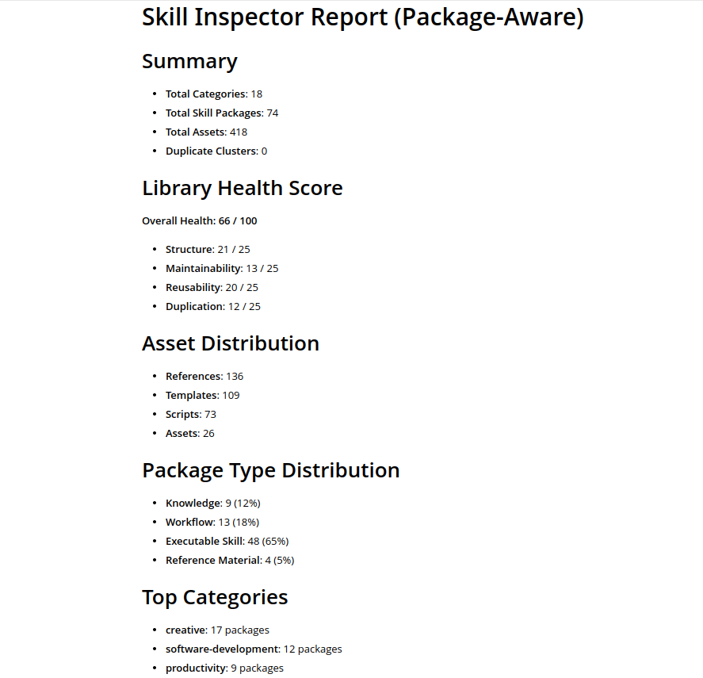
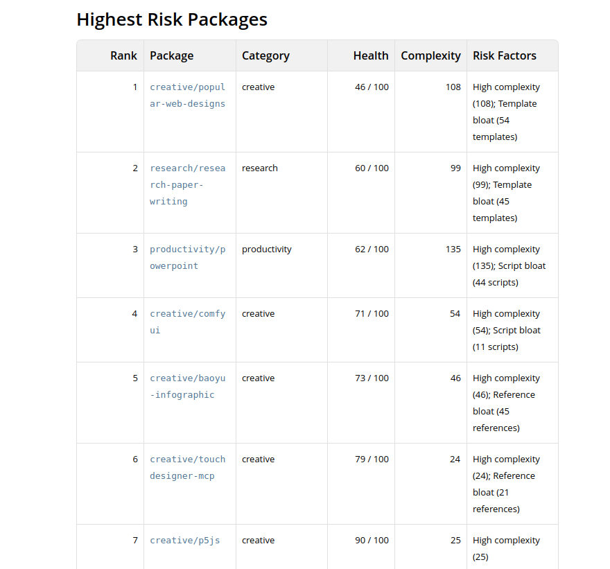
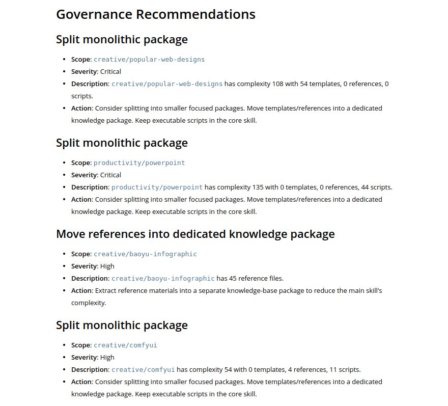

# Skill Inspector

**Governance and Health Checks for Hermes Skills.**

As AI agents accumulate skills, templates, references, scripts, and knowledge, a new problem emerges:

**Skill Sprawl.**

We have tools to create skills.

We have tools to run agents.

But we don't have tools to understand, audit, and govern skill libraries.

Skill Inspector helps answer:

* What skills does my agent actually have?
* Is my skill library healthy?
* Which skills are becoming too large?
* Are there duplicate or overlapping skills?
* How is knowledge organized inside Hermes?

---

## Features

### Skill Library Health Score

Evaluate the overall health of a Hermes skill library.

Example:

```text
Overall Health: 66 / 100

Structure: 21 / 25
Maintainability: 13 / 25
Reusability: 20 / 25
Duplication: 12 / 25
```

---

### Package Analysis

Analyze Hermes skills as Skill Packages:

```text
Category
  ↓
Skill Package
  ↓
References / Templates / Scripts / Assets
```

Understand:

* Skill distribution
* Category breakdown
* Asset composition
* Package complexity

---

### Risk Detection

Automatically detect:

* Monolithic skill packages
* Reference bloat
* Template bloat
* Script bloat
* Duplicate skill packages
* Category concentration

---

### Governance Recommendations

Generate actionable recommendations:

```text
Split oversized packages

Reduce template bloat

Merge overlapping skills

Improve executable skill coverage
```

---

## Example Report

### Overview



### Risk Analysis



### Governance Recommendations



---

## Why Skill Inspector?

As Hermes skill libraries grow, agents accumulate:

* Skills
* References
* Templates
* Scripts
* Assets

Without governance, skill libraries become:

* Difficult to understand
* Hard to maintain
* Redundant
* Less reusable

Skill Inspector provides observability and governance for agent assets.

---

## Installation

Before running any commands, ensure `skill-inspector` is installed.

To install or upgrade to the latest version:

```bash
pip install --upgrade git+https://github.com/johnsonbuilds/skill-inspector.git
```

To install/upgrade to a specific version or tag (e.g., `v0.4.2`):

```bash
pip install --upgrade git+https://github.com/johnsonbuilds/skill-inspector.git@v0.4.2
```

---

## Usage

```bash
skill-inspector <command> [options]
```

Available commands:

### scan-packages(default)

Scan Hermes skills (package-aware) and generate ``report.md``.

```bash
skill-inspector scan-packages [--data-dir DATA_DIR] [--output OUTPUT] [--duplicate-threshold DUPLICATE_THRESHOLD]
```

**Options:**
- ``--data-dir DATA_DIR``: Directory containing ``config.yaml`` and ``skills/`` (default: ``/opt/data``)
- ``--output OUTPUT``: Report path (default: ``report.md``)
- ``--duplicate-threshold DUPLICATE_THRESHOLD``: Cosine similarity threshold for duplicate clusters (default: ``0.82``)

**Example:**

```bash
# Use default data directory
skill-inspector scan-packages

# Specify custom data directory and output
skill-inspector scan-packages --data-dir /path/to/data --output my-report.md --duplicate-threshold 0.85
```

> **Note:** `skill-inspector scan-packages` may take a considerable amount of time to complete depending on the number of skills. You can run it in the background and be notified upon completion:
>
> ```bash
> skill-inspector scan-packages &> scan-output.log &
> echo $! > scan.pid
> wait $(cat scan.pid) && notify-send "skill-inspector scan-packages completed" || notify-send "skill-inspector scan-packages failed"
> ```

---

### health

Generate health report only.

```bash
skill-inspector health [--data-dir DATA_DIR] [--output OUTPUT] [--duplicate-threshold DUPLICATE_THRESHOLD]
```

**Options:**
- ``--data-dir DATA_DIR``: Directory containing ``config.yaml`` and ``skills/`` (default: ``/opt/data``)
- ``--output OUTPUT``: Report path (default: ``health-report.md``)
- ``--duplicate-threshold DUPLICATE_THRESHOLD``: Cosine similarity threshold for duplicate clusters (default: ``0.82``)

**Example:**

```bash
# Use default settings
skill-inspector health

# Specify custom data directory and output
skill-inspector health --data-dir /path/to/data --output health.md
```

---

## Configuration

By default Skill Inspector reads:

```text
/opt/data/config.yaml
/opt/data/skills/
```

The model configuration is reused directly from Hermes.

Example:

```yaml
model:
  provider: ${LLM_PROVIDER}
  base_url: ${LLM_BASE_URL}
  default: ${LLM_MODEL_ID}
  api_key: ${LLM_API_KEY}
```

---

## Supported Providers

Skill Inspector automatically reuses the model configured for Hermes.

Supported providers:

* OpenAI
* OpenRouter
* Anthropic
* Ollama
* Any OpenAI-compatible API

---

## Architecture

```text
Category
  ↓
Skill Package
  ↓
References
Templates
Scripts
Assets
```

Core modules:

* hermes
* package_classifier
* package_duplicates
* package_report
* health
* governance

---

## Open Source

Skill Inspector is open source.

Contributions, ideas, bug reports, and governance experiments are welcome.

If you're exploring how AI agents accumulate, organize, and maintain skills over time, we'd love to hear your findings.

---

## About

Skill Inspector was created to explore a simple question:

> As AI agents accumulate hundreds of skills, templates, references, and scripts, how do we keep them understandable, maintainable, and healthy?

The project focuses on **Agent Asset Governance** for Hermes and other agent ecosystems.

---

## License

Apache License 2.0
